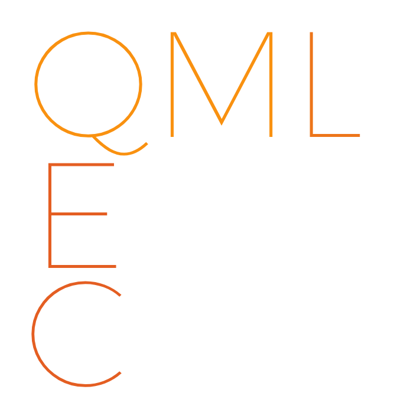
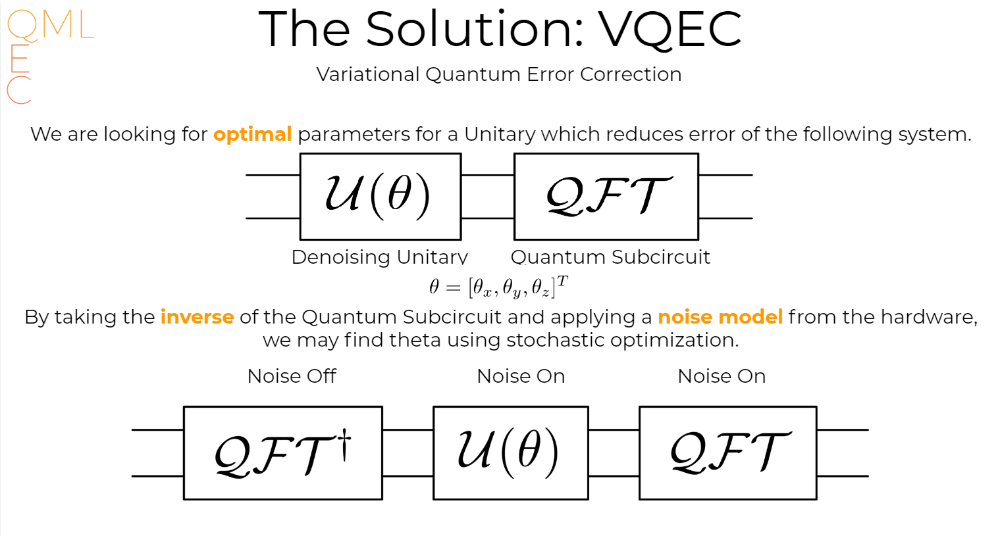
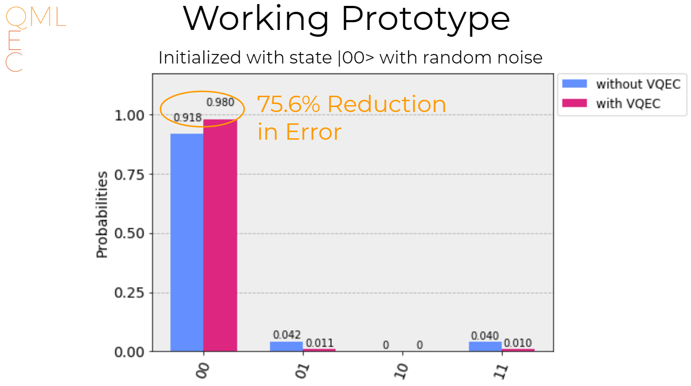

# QML-QEC

### Quantum Futures Hackathon at CERN

We developed an alternative approch for quantum error correction of noisy quantum hardware. 

### Team
Illia Babounikau, Sadra Boreiri, David Ittah, Jake Malliaros, Dmitry Grinko, Anton Karazeev 

### Installation

You need to pass your `API key` for IBM Q Experience service: put it in [res/qiskit_apikey.json](res/qiskit_apikey.json) file.
